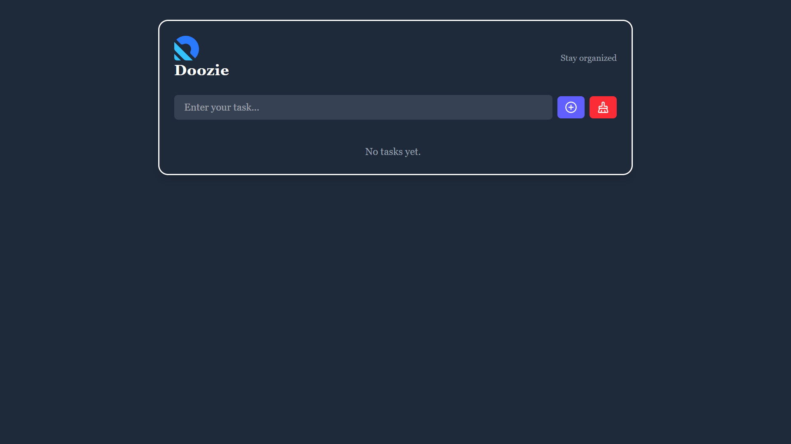
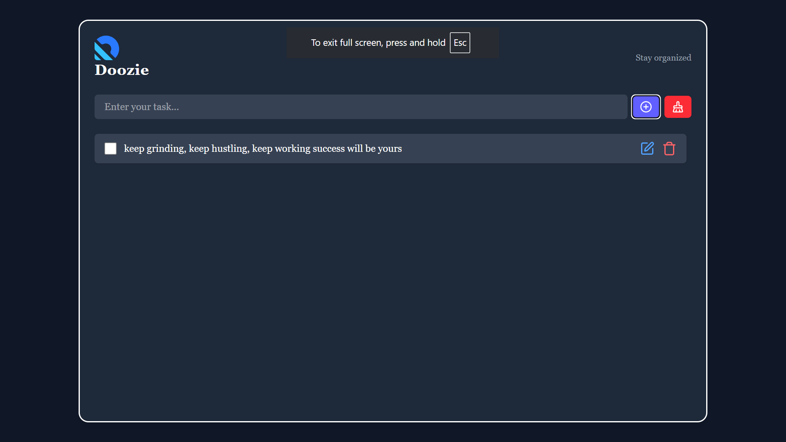

# 📝 Doozie — Your Daily To-Do Companion

Welcome to **Doozie** — a beautifully minimal yet powerful task manager built with **React + Tailwind CSS**. Manage your day, keep track of your goals, and never miss a task again.

---

## ✨ Features

- ✅ Add, edit, and delete tasks
- 💾 Persistent storage via `localStorage`
- 🖍️ Elegant UI with responsive design (mobile-first)
- 🧹 Clear all tasks in one click
- ⚡ Smooth animations & modern iconography (Lucide)

---

## 📸 Preview

<p align="center">
  
  
</p>

---

## 🚀 Live Demo

👉 [Click here to try it live](https://dooziecv.netlify.app/)  
*(Hosted on Netlify)*

---

## 🛠️ Tech Stack

- [React.js](https://reactjs.org/)
- [Tailwind CSS](https://tailwindcss.com/)
- [Lucide Icons](https://lucide.dev/)
- [UUID](https://www.npmjs.com/package/uuid) for unique IDs

---

## 🧠 Getting Started

### 1. Clone the repo

```bash
git clone https://github.com/Developer200010/Doozie.git
```

### 2. Change directory

```bash
cd Doozie
```
### 3. install require modules

```bash
npm install
```
### 4. use this command to run locally.

```bash
npm run dev
```

## Now you are go to go✌️.